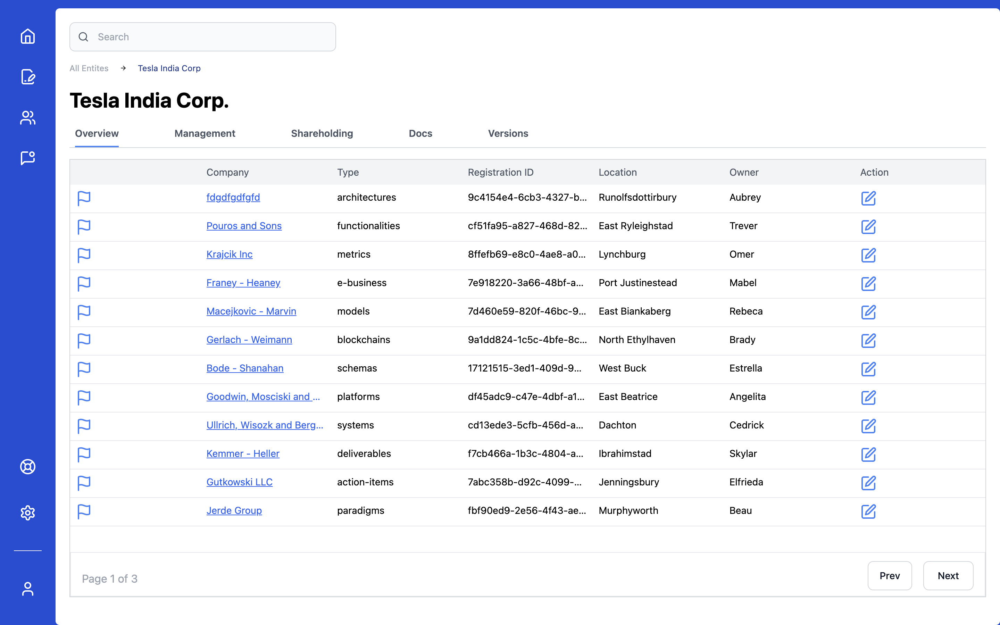

# CredHive Task


## Auth 
## Note - You can enter any email id and password to login


## Preview Video - <a href="https://sreehari-jayaraj.neetorecord.com/watch/1166d3e6-147a-4a83-9d7f-a861db0e7113">Link</a>

## Tech Stack Used
 - React js
 - Vite js
 - React router dom
 - Zod
 - React hook form
 - Tailwind css
 - vitest for testing
 - Typescript


 ## Pages

 - There are two pages
 - Login Page
 - DashBoard Page

### You can find the tests in   `/src/tests` folder

 ### Run locally

 ```bash
   pnpm install
   pnpm run dev
   
   // to run test
   pnpm run test
 ```

### Description
- Able to login
- Able to edit the data
- Able to select the data
- Pagination
- Data validation


 

  

  

  ### Test results

  